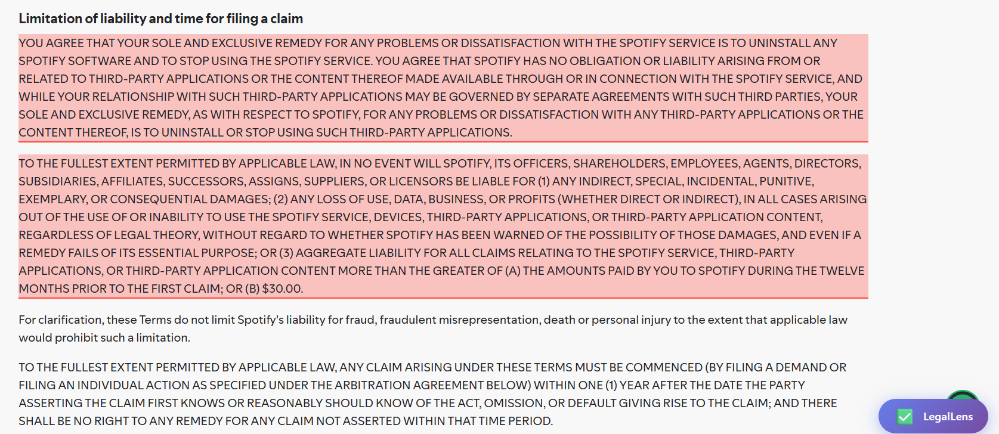
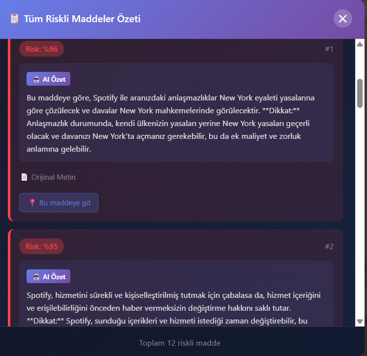
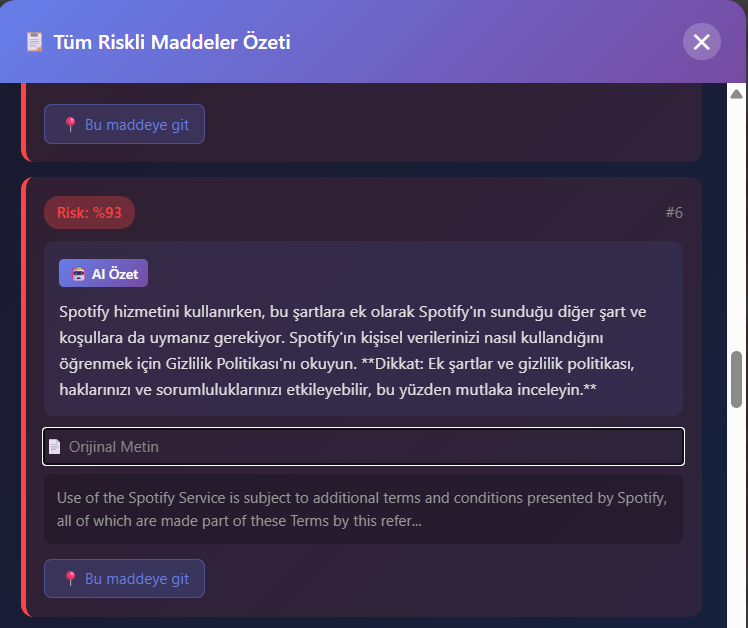
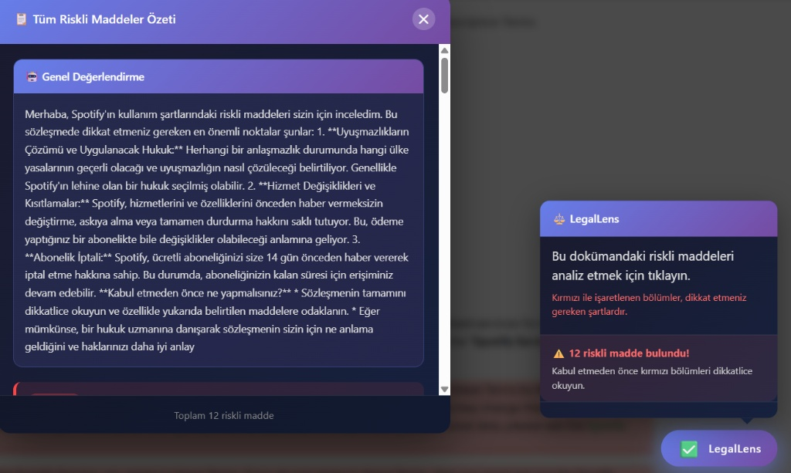

# ⚖️ LegalLens: AI-Powered T&C Analyzer

> **Neural Networks Course Final Project**  
> *Automatic Text Summarization & Risk Detection in Legal Documents*


**LegalLens** is an intelligent tool designed to analyze long and complex "Terms and Conditions" (T&C) agreements. Instead of reading thousands of words, users can instantly identify "unfair" or "risky" clauses hidden in the fine print.

This project implements a **Hybrid AI Architecture**:
1.  **Detection:** A custom **Bi-Directional LSTM with Attention Mechanism** identifies potentially risky sentences.
2.  **Explainability:** **Google Gemini API** generates simplified, human-readable summaries of these risks.

### ✨ Key Features

* 🔍 **Intelligent Risk Detection** - Automatically identifies potentially unfair clauses in legal documents
* 🧠 **Deep Learning Model** - Custom Bi-LSTM with Attention mechanism trained on legal text
* 📝 **Explainable AI (XAI)** - Translates complex legal jargon into simple summaries using Gemini
* ⚡ **Real-time Analysis** - Fast processing through optimized FastAPI backend
* 🌐 **Browser Integration** - Chrome extension for seamless webpage analysis
* 📊 **Sentence-level Scoring** - Detailed risk scores for each clause

---

## 📸 How It Works (Demo)

LegalLens operates seamlessly in your browser to protect your digital rights.

### 1. Seamless Integration & Detection
As soon as you open a Terms & Conditions page (e.g., Spotify), LegalLens is ready. Upon analysis, our **Bi-LSTM model** scans the text in real-time and **highlights risky clauses in red** directly on the webpage.


*Real-time risk detection and highlighting on the webpage.*

### 2. AI-Powered General Overview
Clicking the LegalLens button opens the smart dashboard. **Google Gemini AI** analyzes the detected risks and provides a "General Assessment" in plain language, summarizing the overall danger level.


*The dashboard provides a high-level summary and total risk count.*

### 3. Detailed Clause Analysis & Navigation
You can inspect each risk individually. The card shows:
* **Risk Score:** The model's confidence level (e.g., Risk: %96).
* **AI Summary:** A simplified explanation of the specific legal jargon.
* **Navigation:** The **"Bu maddeye git"** button automatically scrolls the page to the exact location of the risky clause.


*Detailed breakdown of specific clauses with AI-generated explanations.*

### 4. Complete Workflow
The extension provides a non-intrusive experience, overlaying critical information directly onto the document context without disrupting readability.


*Combined view of the document highlighting and the AI assistant popup.*

---

## 🎯 Project Goals

### Academic Objectives
* Implement and understand RNNs (LSTM/GRU) and Attention mechanisms from scratch
* Explore sequence modeling without relying on pre-trained Transformers like BERT
* Apply deep learning techniques to Natural Language Processing challenges
* Evaluate model performance on real-world legal text data

### Practical Objectives
* Solve the "nobody reads T&C" problem with an accessible browser extension
* Provide users with actionable insights about legal documents
* Create a scalable solution for automated legal text analysis

## 🏗️ System Architecture

The system consists of three main components working together:

### 1. Core AI Model (PyTorch)
* **Embedding Layer:** GloVe word embeddings (300-dimensional) or custom trained embeddings
* **Encoder:** Bi-Directional LSTM to capture contextual information from both directions
* **Attention Mechanism:** Calculates the importance/contribution of each word and sentence to the overall "risk" score
* **Classifier:** Binary classification layer (Safe vs. Unfair clauses)
* **Output:** Sentence-level risk scores and predictions

### 2. Backend API (FastAPI)
* Serves the trained PyTorch model via RESTful API endpoints
* Handles text preprocessing, tokenization, and normalization
* Manages model inference and response formatting
* Provides `/analyze` endpoint for document analysis
* CORS-enabled for browser extension integration

### 3. Frontend (Chrome Extension)
* Extracts text content from active browser tabs
* Sends text to backend API for analysis
* Highlights risky sentences directly on webpages using color-coded indicators
* Provides popup interface with detailed risk summary
* User-friendly controls for enabling/disabling analysis

## 📂 Dataset

We utilize the **LexGLUE (Legal General Language Understanding Evaluation)** dataset, specifically the **Unfair-ToS** subset.

### Dataset Details
* **Source:** LexGLUE - Legal Language Understanding Benchmark
* **Subset:** Unfair Terms of Service (Unfair-ToS)
* **Content:** Annotated Terms of Service agreements from various online platforms
* **Labels:** Binary labels indicating unfair contractual terms
* **Size:** Thousands of annotated sentences from real T&C documents
* **Purpose:** Training the model to identify potentially unfair clauses

## 🚀 Installation & Usage

### Prerequisites
* Python 3.9 or higher
* pip (Python package manager)
* Google Chrome browser
* Git

### 1. Clone Repository

```bash
git clone https://github.com/Otu-Data-ML-Projects/LegalLens.git
cd LegalLens
```

### 2. Setup Python Environment

**On Windows (PowerShell):**
```powershell
python -m venv venv
.\venv\Scripts\Activate.ps1
pip install -r requirements.txt
```

**On Linux/macOS:**
```bash
python -m venv venv
source venv/bin/activate
pip install -r requirements.txt
```

### 3. Start Backend Server

```powershell
cd src/api
uvicorn main:app --reload
```

The API will be available at `http://localhost:8000`  
API documentation at `http://localhost:8000/docs`

### 4. Load Chrome Extension

1. Open Google Chrome and navigate to `chrome://extensions/`
2. Enable **"Developer mode"** using the toggle in the top-right corner
3. Click **"Load unpacked"** button
4. Select the `extension/` folder from the project directory
5. The LegalLens extension icon should appear in your Chrome toolbar

### 5. Usage

1. Ensure the backend server is running
2. Navigate to any webpage with Terms & Conditions or Privacy Policy
3. Click the LegalLens extension icon
4. Click **"Analyze Page"** to scan the current page
5. Risky clauses will be highlighted on the page with risk scores

## � Model Training

To train the model from scratch:

```powershell
cd src/model
python architecture.py --train
```

Training parameters can be configured in the model file. Pre-trained weights are included in `legal_lens_bi_lstm_attention_weights.pth`.

## 📊 Project Structure

```
LegalLens/
├── extension/          # Chrome extension files
│   ├── background.js   # Background service worker
│   ├── content.js      # Content script for page manipulation
│   ├── manifest.json   # Extension configuration
│   ├── styles.css      # Styling for highlights
│   └── icons/          # Extension icons
├── src/
│   ├── api/           # FastAPI backend
│   │   ├── main.py    # API endpoints
│   │   └── config.py  # Configuration settings
│   └── model/         # PyTorch model
│       ├── architecture.py  # Model definition
│       ├── dataset.py       # Dataset handling
│       └── legal_lens_bi_lstm_attention_weights.pth
├── notebooks/         # Jupyter notebooks for exploration
├── requirements.txt   # Python dependencies
└── README.md
```

## 🤝 Contributing

This is an academic project, but suggestions and improvements are welcome!

1. Fork the repository
2. Create your feature branch (`git checkout -b feature/AmazingFeature`)
3. Commit your changes (`git commit -m 'Add some AmazingFeature'`)
4. Push to the branch (`git push origin feature/AmazingFeature`)
5. Open a Pull Request

## 📧 Contact

**Project Team:**
- [Emre Kocakaplan](https://www.linkedin.com/in/emre-kocakaplan-b6ba592b6) - LinkedIn
- [Yağız Han Aslan](https://www.linkedin.com/in/yagizhanaslan) - LinkedIn

**Project Scope:** Ostim Technical University - Neural Networks Course  
**Repository:** [https://github.com/Otu-Data-ML-Projects/LegalLens](https://github.com/Otu-Data-ML-Projects/LegalLens)

## 📝 License

This project is developed for educational purposes as part of the Neural Networks course at Ostim Technical University.

## 🙏 Acknowledgments

* LexGLUE dataset creators for providing high-quality legal text data
* PyTorch community for excellent deep learning frameworks
* FastAPI team for the modern web framework
* Our course instructor for guidance and support

---

**⚠️ Disclaimer:** This tool is designed for educational purposes and should not be considered as legal advice. Always consult with a qualified legal professional for important legal matters.